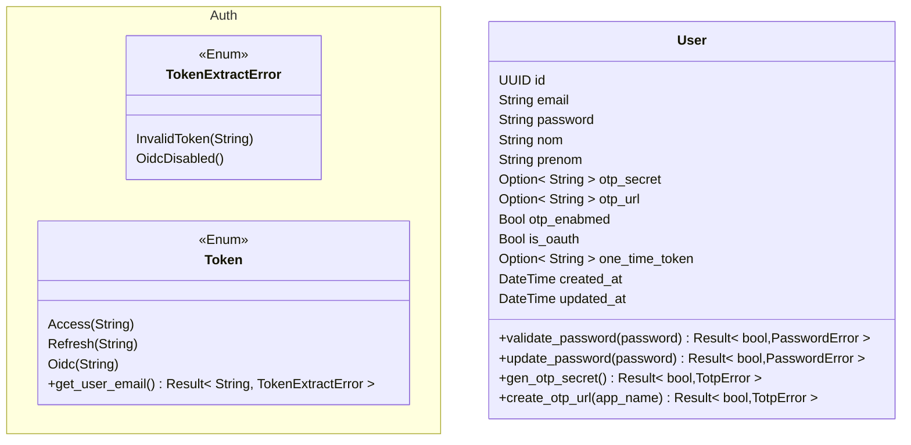
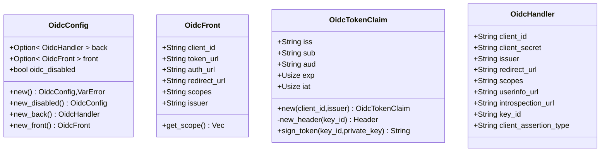
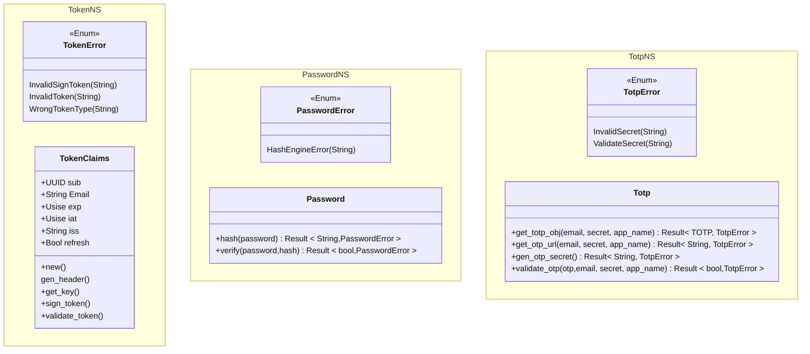

# Rust Template / Hexa

## What's the goal of this rewrite ?

The goal of this rewrite is to make the code more readable, more maintainable and more efficient. It's also a good way to learn how to write test in Rust and go further in the hexa archi.

## Step

### 1. Rewrite the code

- [ ] Bring back the authentification system
- [ ] Bring back the User/Password sys (Otp and register)
- [ ] Bring back the User/OIDC sys
- [ ] Dev the app without taking into account the database sys
- [ ] Include Postgres database
- [ ] Include InMemory database
- [ ] Versioning of the api (/api/v1/...)
- [ ] Include Tracing
- [ ] Include Metrics (use the metrics from OpenTelemetry?)

### 2. Write tests

- [ ] Write unit tests
- [ ] Include test in the CI/CD
- [ ] Write integration tests

### 3. New features

- [ ] Dev api for the new BackOffice
- [ ] Integrates the future VueTS Front

## Hexa WorkFlow

### Hexa Archi

### Domain

#### Auth && User

#### Auth Oidc

#### Auth Local

